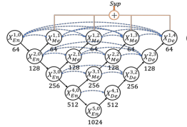
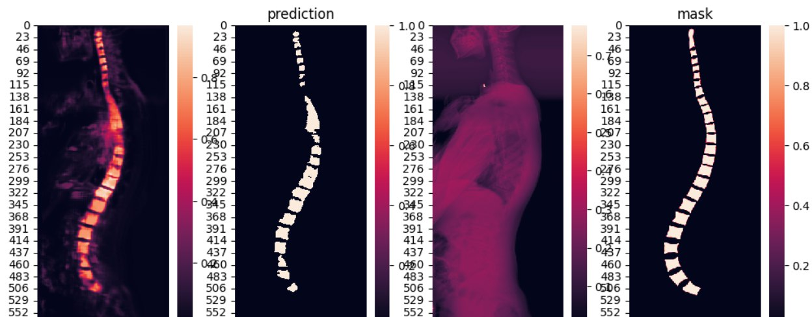

# Spine Segmentation

All doctors around the World, while analysing rengen images, still use ruler and monitor. So, what if the programm would select spine out of other body bones and compute all differences and angles?

## Content
1. **[Problem Explaination](#problem-explanation)**
2. **[Problem Analysis](#problem-analysis)**
3. **[Solution and ML Methods](#ml-methods)**
4. **[Measures, Training Protocols and Results](#training-protocols-measures-and-results)**

## Problem Explanation

We need to select and separate every vertebra from other bones on grayscale image and draw some vertebras which can be hidden behind bones. Than find corners' coordinates of each vertebra.

## Problem Analysis

### Problem Type

Segmentation

### Data Analysis

1. 500 Dicom files as train data, each of them contains:
    - pixel array (4608 x 1920) in grayscale format (each pixel value is in [0, 255]) - rengen.
    - age (in [0, 120])
    - gender (0 - male, 1 - female)
2. 500 PNG images as test data - pixel array (4608 x 1920) in grayscale format (each pixel value is in [0, 255]) - mask of spine's vertabras.

### Feature engineering

- All vertebras are trapecioid shape.
- Count of vertebras in human body is fixed in most cases.
- Some vertebras are joined, need to separate them.
- each vertebra position correlates with body type, pose, age and gender.
- There also side and frontal views.

## ML Methods

- The first model I tryed is [Unet++](https://arxiv.org/abs/2004.08790). This model is widely used in medical image segmentation. Here I used only dicom pixel data as input. 

## Training Protocols, Measures and Results

Training contained 20 epoches. Batch-Size is 16. Supervision learning was used (x1.1, x1.2, x1.3, x1.4 losses are combined in one).

| Model name | Train Loss | Train Metrics | Eval Loss | Eval Metrics |
| ---------- | ---------- | ------------- | --------- | ------------ |
| Unet++ | DiceLoss 1.88 | DiceCoef 2.12 | DiceLoss 1.55 | DiceCoef 2.45 |

### Results

